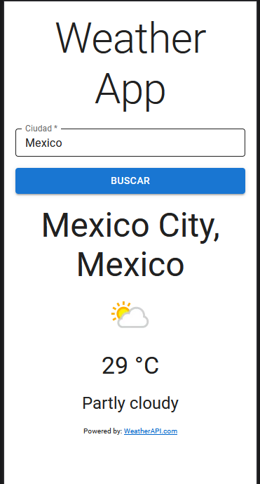

# Weather App

Simple app to see the weather in a country, it is possible by [WeatherAPI](https://www.weatherapi.com/) ⛅.

## Preview
You can see the result on https://eduardovr.com/weather/.

    

## Used technologies
* React Js
* Material UI
* Vite

## Configuration 
* Run `npm install`.
* Create `.env.local` file and add the environment variable `VITE_API_KEY`.
* Paste your API key, you can get it on https://www.weatherapi.com/.
* Run `npm run dev` and see the result on http://localhost:5173/